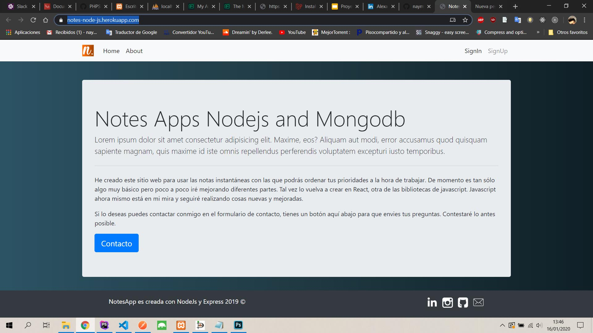
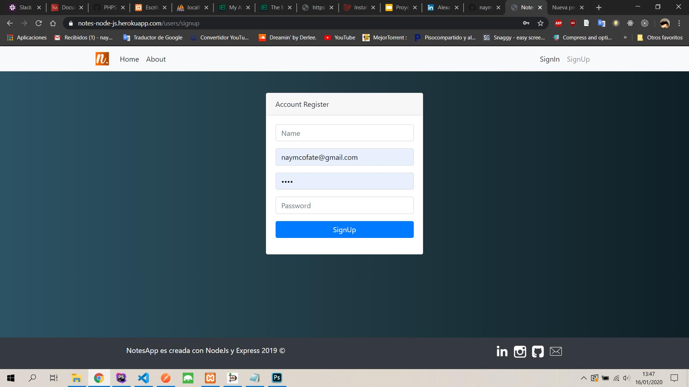
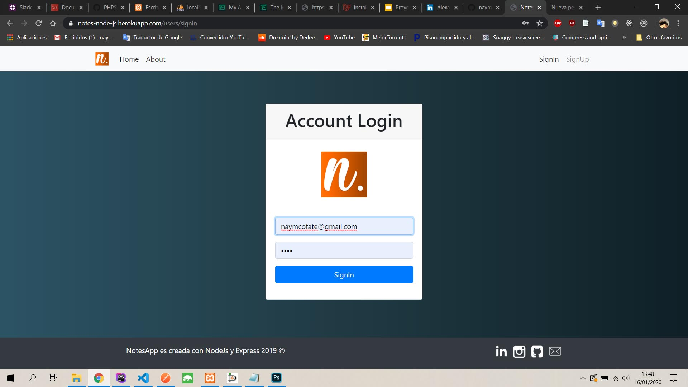
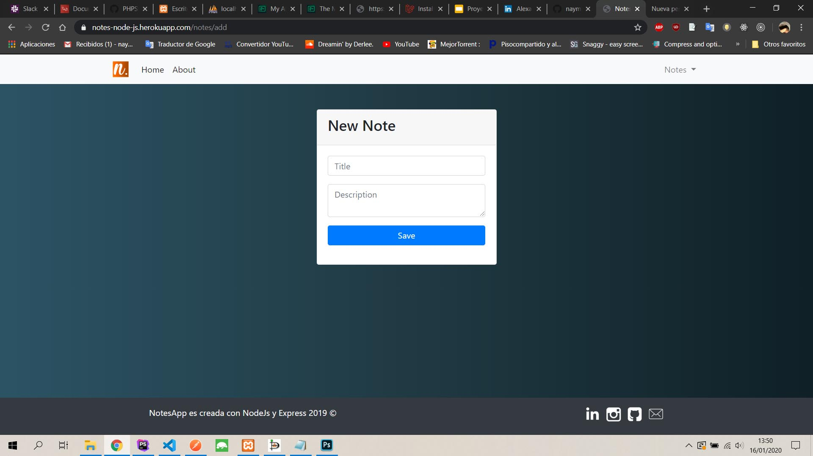

# notes-app
Aplicación creada con Nodejs, express, mongodb y motor de plantilla handlebars.

Enlace de la aplicación
https://notes-node-js.herokuapp.com/

## Screenshots
Vista principal de la aplicación

Vista de registro de usuarios

Vista del login del usuario

Vista de nuevas notas

Vista principal de las notas agregadas

